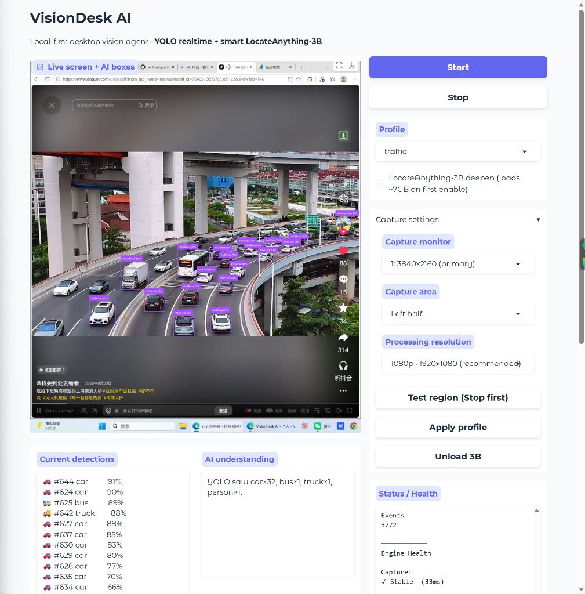
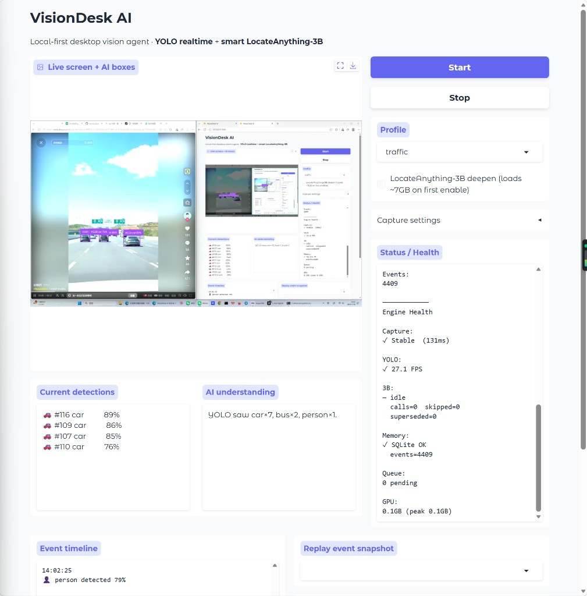
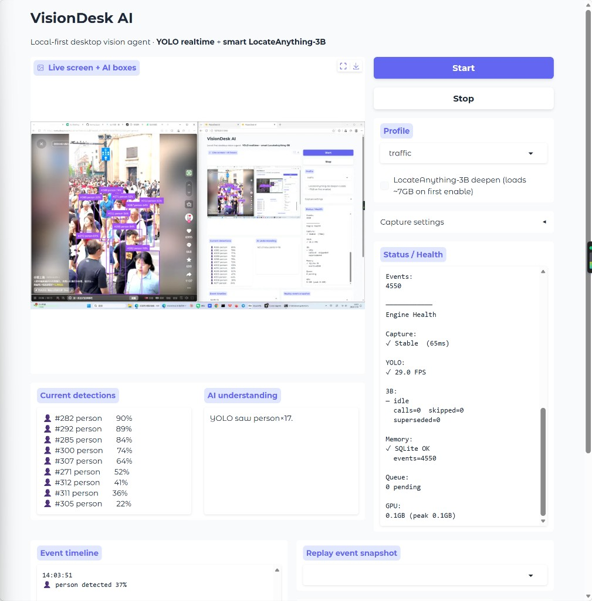

# VisionDesk AI

<p align="center">
  <strong>English</strong> · <a href="README.zh-CN.md">简体中文</a>
</p>

**Local-first desktop vision agent** — real-time screen perception, adaptive YOLO detection, and a deep reasoner (LocateAnything-3B or Mage-VL) only when it matters.

<p>
  <a href="https://github.com/leohux/VisionDesk-AI/actions/workflows/ci.yml"></a>
  <a href="https://github.com/leohux/VisionDesk-AI/releases/latest"></a>
  <a href="LICENSE"></a>
  <a href="https://www.python.org/downloads/"></a>
</p>

> Privacy-first: runs on **your GPU**. No cloud upload required for the core loop.




```text
Screen / ROI
    ↓
YOLO realtime (≈34–38 FPS)
    ↓
Smart Trigger Router
    ↓
LocateAnything-3B | Mage-VL  ← only when uncertain / new / forced
    ↓
AI Summary → SQLite Event Memory → Timeline Replay
```

## Why this exists

Most “AI vision” demos either:

- burn the GPU on every frame with a heavy VLM, or
- stay at YOLO-only and never explain *what is going on*.

VisionDesk sits in between: **fast eyes + selective brain**.

| Capability | Status |
|---|---|
| Real-time screen / ROI capture | ✅ |
| YOLO adaptive detection | ✅ |
| Adaptive Vision Routing (deep VLM on demand) | ✅ |
| Event memory + snapshot replay | ✅ |
| Gradio cockpit + OpenCV desktop | ✅ |
| Offline replay / benchmark CLI | ✅ |
| Scene profiles (YAML) | ✅ |
| Mage-VL narrate on trigger | ✅ |
| VLM Q&A over event history | 🚧 later |

## Performance (v0.1.0)

Measured offline on a 377-frame traffic clip (`traffic` profile, ~16GB CUDA):

| Mode | FPS | 3B calls | Reasoning efficiency | GPU |
|------|-----|----------|----------------------|-----|
| YOLO only | **37 FPS** | 0 | — | YOLO-only |
| YOLO + smart 3B | **23 FPS** | **6 / 377** | **62.8 frames / call** | ~8–10 GB |

≈ **98.3%** of deepen candidates skipped · queue pending ≤ 1

Reproduce with any local video or image:

```bash
python visiondesk.py replay path/to/video.mp4 --profile traffic --json
python visiondesk.py replay path/to/video.mp4 --profile traffic --no-deep --json
```

Numbers live in [`demo/benchmark/SUMMARY.json`](demo/benchmark/SUMMARY.json).

## Screenshots





## Quick start

### 1. Install

```bash
git clone https://github.com/leohux/VisionDesk-AI.git
cd VisionDesk-AI

# Install CUDA PyTorch for your GPU first: https://pytorch.org
pip install -r requirements.txt

# Optional: place yolov8m.pt in the project root (Ultralytics can also auto-download)
```

### 2. Launch the Gradio cockpit (recommended)

```bash
python visiondesk.py ui
# or
python app_ui.py
```

Open **http://127.0.0.1:7860**

Suggested first run:

1. Profile `traffic`, **LocateAnything-3B OFF** → confirm live FPS
2. Open **Capture settings** → pick monitor / 1080p processing
3. Enable 3B when ready (~7GB VRAM on first load)
4. Watch **Event Timeline** → click an event to replay its snapshot

### 3. OpenCV desktop window

```bash
python main.py --profile general
python main.py --profile traffic --select-roi
python main.py --profile person --no-deep
```

| Key | Action |
|-----|--------|
| `q` / `ESC` | Quit |
| `1`–`4` | Switch profile |
| `d` | Toggle deep reasoner |
| `r` | Re-select ROI |
| `s` | Save snapshot |

### 4. Replay / benchmark any video or image

```bash
python visiondesk.py replay path/to/video.mp4 --profile traffic --json
python visiondesk.py replay shot.jpg --profile general --no-deep
```

## Deep reasoner setup

YOLO-only mode works out of the box. Deepen is optional and **loads only one**
backend at a time (set in each profile):

```yaml
deep_backend: locate3b   # or mage_vl | none
```

### LocateAnything-3B (box grounding)

1. Download / clone [nvidia/LocateAnything-3B](https://huggingface.co/nvidia/LocateAnything-3B) locally.
2. Point VisionDesk at it:

```bash
set LOCATE_ANYTHING_PATH=C:\path\to\LocateAnything-3B   # Windows
export LOCATE_ANYTHING_PATH=/path/to/LocateAnything-3B  # Linux/macOS
```

```yaml
deep_backend: locate3b
locate3b:
  enabled: true
  model_path: LocateAnything-3B
```

### Mage-VL (AI understanding / narrate)

[Mage-VL](https://huggingface.co/microsoft/Mage-VL) turns a triggered ROI into natural-language
understanding for the **AI understanding** panel (no detection boxes). YOLO keeps drawing boxes.

```bash
# optional local checkout
set MAGE_VL_PATH=C:\path\to\Mage-VL
# or let transformers download microsoft/Mage-VL
```

```yaml
deep_backend: mage_vl
mage_vl:
  model_path: microsoft/Mage-VL
  max_side: 960
  max_new_tokens: 256
  question: "Briefly describe what is happening in this scene."
```

Mage wants a recent `transformers` (upstream docs mention ≥5.7). If that conflicts with
LocateAnything’s stack, use separate Python envs or stick to one `deep_backend`.

## Architecture

```text
Gradio UI / CLI
       ↓
api/controller.py     ← engine facade, deep VLM singleton cache, health
       ↓
Capture → YOLO → DualBrain Router → LocateAnything-3B | Mage-VL
       ↓
SQLite events + optional frame snapshots
```

```text
VisionDesk-AI/
├── visiondesk.py          # CLI: ui | replay
├── app_ui.py              # Gradio entry (crash-safe)
├── main.py                # OpenCV desktop entry
├── api/controller.py      # Vision Engine
├── core/                  # capture, dual_brain, health, events, factory
├── models/                # yolo, locate3b, mage_vl
├── profiles/              # YAML scenes (deep_backend switch)
├── ui/gradio_app.py       # Cockpit
├── tools/replay.py        # Offline benchmark
├── docs/screenshots/      # README UI captures
└── demo/benchmark/        # measured FPS / deep-call stats
```

## Profiles

| Profile | Best for |
|---------|----------|
| `general` | Everyday objects |
| `traffic` | Vehicles + people |
| `person` | People-focused |
| `security` | Higher-sensitivity / force labels |
| `gaming` | Example custom profile |

Edit `profiles/*.yaml` — user-facing sections: `detection`, `trigger`, `reasoning`,
`capture`, `deep_backend`, `locate3b`, `mage_vl`.

Default processing width is **1920px (1080p)** for stable FPS on 4K monitors; raise to 1440p / native in the UI when you need more detail.

## Requirements

- Python **3.10+**
- CUDA GPU recommended (16GB+ comfortable for YOLO + one deep VLM)
- `yolov8m.pt` (or change weights in profile)
- LocateAnything-3B **or** Mage-VL only if you enable deepen

## Roadmap

| Version | Focus |
|---------|--------|
| **v0.1.0** | Perception + adaptive deepen + memory + cockpit + benchmark |
| **v0.1.x** | Mage-VL narrate on smart trigger |
| later | VLM Q&A over event history; Mage streaming / codec path |

## Contributing

Issues and PRs welcome. See [CONTRIBUTING.md](CONTRIBUTING.md) for dev setup and
the CI gate. In short:

- no drive-by refactors
- include a short note if you change trigger / profile defaults
- for performance claims, attach `visiondesk.py replay … --json` output

Security reports: please use the private flow in [SECURITY.md](SECURITY.md).
This project follows a [Code of Conduct](CODE_OF_CONDUCT.md).
Release history is tracked in [CHANGELOG.md](CHANGELOG.md).

> Early standalone prototypes have moved to [`legacy/`](legacy/) — the supported
> entry points are `visiondesk.py`, `app_ui.py`, and `main.py`.

## License

[MIT](LICENSE) © 2026 [leohux](https://github.com/leohux)

YOLO / Ultralytics, Supervision, and LocateAnything-3B remain under their respective licenses.
